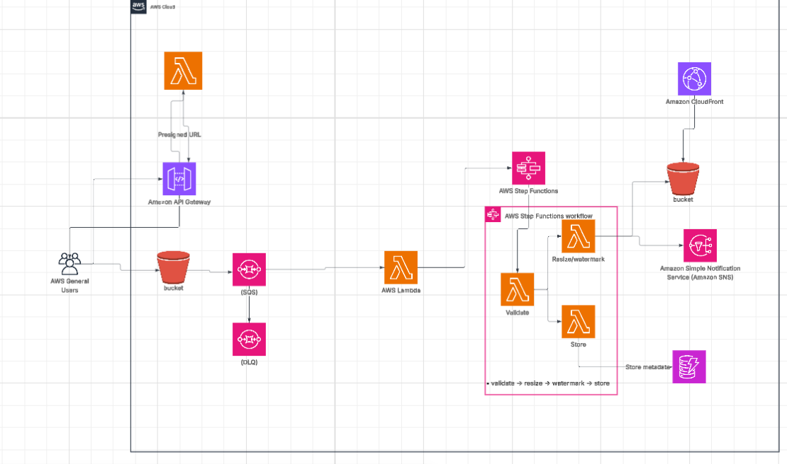

# -aws-serverless-image-pipeline
Serverless Image Processing Pipeline with S3, SQS &amp; Lambda
# 🖼️ AWS Serverless Image Processing Pipeline — S3, SQS, Lambda & Step Functions

> Event-driven serverless pipeline that automatically resizes, watermarks, 
> and delivers images globally using S3, SQS, Lambda, Step Functions, and CloudFront.

---

## 📌 Project Overview

This project demonstrates a fully serverless image processing pipeline on AWS.
When a user uploads an image, it triggers an automated multi-step workflow that
validates, resizes, watermarks, and stores the processed result — all without
managing any servers. Step Functions orchestrate the workflow, SQS decouples
the processing from the upload event, and CloudFront delivers the final images
globally with low latency.

---

## 🏗️ Architecture Diagram

---

## ☁️ AWS Services Used

| Service | Role |
|---|---|
| **Amazon S3 (source)** | Receives user uploads, triggers event notifications |
| **Amazon S3 (destination)** | Stores processed/resized/watermarked images |
| **Amazon SQS** | Decouples S3 events from Lambda processing |
| **SQS Dead-Letter Queue (DLQ)** | Captures failed messages for inspection and retry |
| **AWS Lambda** | Image resize and watermark processing; polls SQS |
| **AWS Step Functions** | Orchestrates multi-step workflow: validate → resize → watermark → store |
| **Amazon API Gateway** | Pre-signed URL generation endpoint for secure uploads |
| **Amazon DynamoDB** | Stores image metadata (upload time, dimensions, status) |
| **Amazon CloudFront** | Serves processed images globally with low latency |
| **Amazon SNS** | Sends notifications on job completion or failure |

---

## 🔄 Pipeline Flow

### Upload Flow
User
→ API Gateway (request pre-signed URL)
→ Lambda (generates pre-signed URL)
→ User uploads image directly to S3 source bucket

### Processing Flow
S3 source bucket (upload event)
→ SQS Queue (decoupled event)
→ Lambda (polls SQS, triggers Step Functions)
→ Step Functions Workflow:
├── Step 1: Validate   (format, size, type check)
├── Step 2: Resize     (thumbnail + full resolution)
├── Step 3: Watermark  (apply branding overlay)
└── Step 4: Store      (save to S3 destination + metadata to DynamoDB)
→ S3 destination bucket
→ CloudFront (serve globally)
→ SNS (notify on success or failure)

---

## 🪜 Step Functions Workflow Detail
                ┌─────────────┐
                │   Validate  │  ← check format, dimensions, file size
                └──────┬──────┘
                       │
                ┌──────▼──────┐
                │    Resize   │  ← generate thumbnail + full-res versions
                └──────┬──────┘
                       │
                ┌──────▼──────┐
                │  Watermark  │  ← overlay logo/text branding
                └──────┬──────┘
                       │
                ┌──────▼──────┐
                │    Store    │  ← S3 destination + DynamoDB metadata
                └─────────────┘

---

## 🛡️ Reliability & Error Handling

| Mechanism | Purpose |
|---|---|
| **SQS Decoupling** | Upload events are not lost if Lambda is busy or fails |
| **Dead-Letter Queue** | Failed messages after max retries go to DLQ for inspection |
| **Step Functions retries** | Each step can retry independently on failure |
| **SNS Alerts** | Immediate notification on pipeline failure |
| **S3 Versioning** | Protects against accidental overwrites |

---

## 💾 S3 Lifecycle Rules

| Rule | Action |
|---|---|
| Source bucket — after 7 days | Transition to S3 Infrequent Access |
| Source bucket — after 30 days | Expire (delete) original uploads |
| Destination bucket — after 90 days | Transition to S3 Glacier |

---

## 📡 Observability

- **CloudWatch Logs** — Lambda execution logs, Step Functions execution history
- **CloudWatch Alarms** — DLQ message count, Lambda error rate
- **SNS Notifications** — job completion and failure alerts
- **DynamoDB** — full metadata history per image (status, timestamps, dimensions)
- **Step Functions Console** — visual execution graph per workflow run

---

## 📚 Key Learning Outcomes

- ✅ Design event-driven architectures using S3 event notifications and SQS
- ✅ Understand why SQS decoupling improves resilience and enables retries
- ✅ Use Lambda Layers to package large dependencies (Pillow / Sharp libraries)
- ✅ Orchestrate multi-step serverless workflows with Step Functions
- ✅ Apply S3 lifecycle policies to transition or expire objects by storage class
- ✅ Generate pre-signed URLs for secure direct-to-S3 uploads via API Gateway
- ✅ Store and query image metadata efficiently in DynamoDB
- ✅ Serve processed content through CloudFront with appropriate cache behaviors

---

## 🗂️ Repository Structure
aws-image-processing-pipeline/
│
├── architecture/
│   └── architecture-diagram.png
│
├── README.md
└── LICENSE

---

## 👤 Author

**Mohamed Gehad**
- GitHub: [@MohamedGehad12](https://github.com/MohamedGehad12)

---

## 📄 License

This project is licensed under the MIT License.
